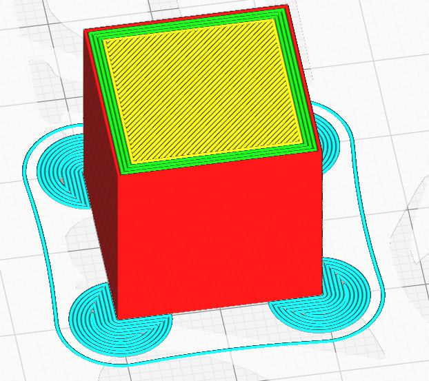
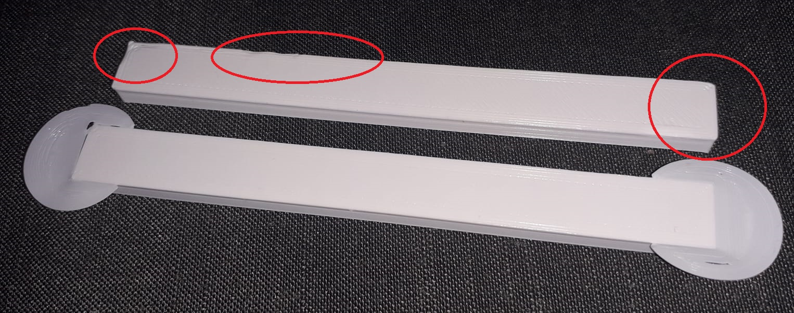
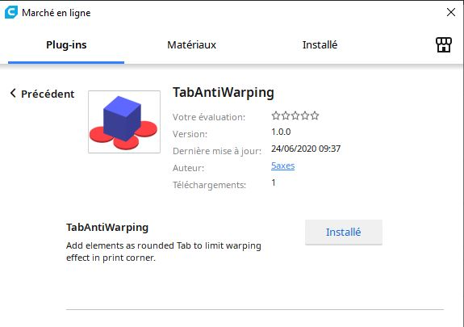
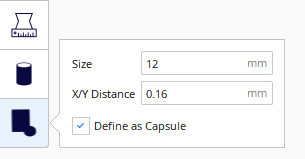
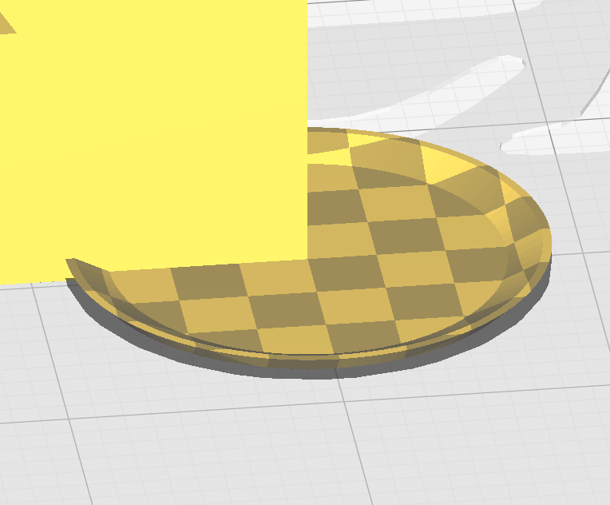
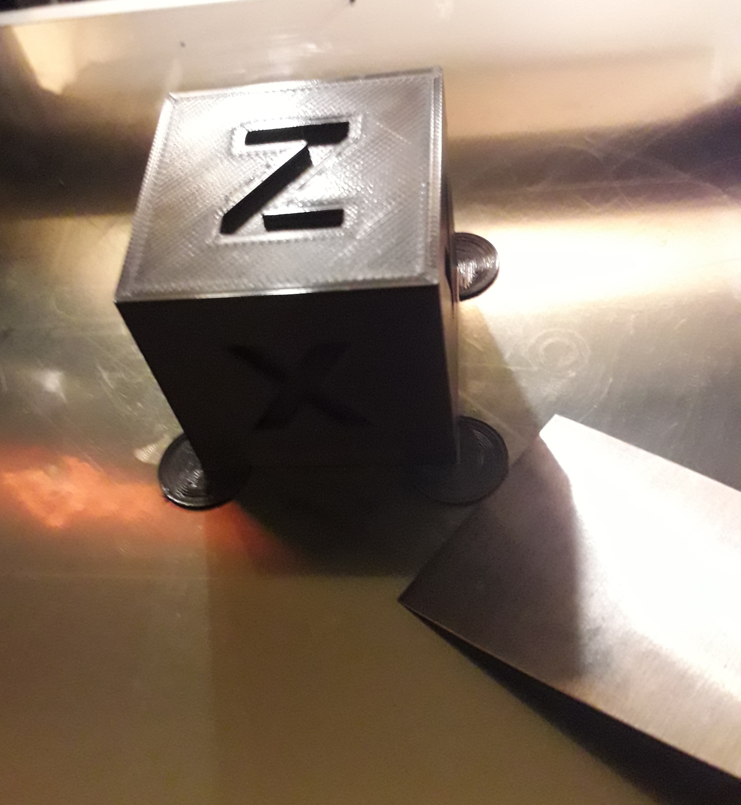
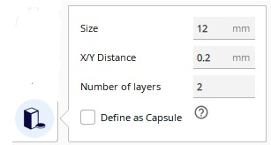
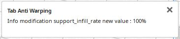

# Tab Anti Warping
Add element as rounded Tab to limit warping effect in print corner.

Using Helper Disks, which act on the corners of your model to help keep everything pinned down. Once the print is finished, the disks can be cut away pretty easily.

Test with a diameter of 20mm and Support X/Y Distance=0.2mm. To keep a support with a full pattern don't goes over 20/25mm.

**Note : Actual solution is limited by the possibility to use just a global : Support X/Y Distance**

## Installation
First, make sure your Cura version is  4.4 or newer.

Manual Install Download & extract the repository as ZIP or clone it. Copy the files/plugins/TabAntiWarping directory to:

on Windows: [Cura installation folder]/plugins/TabAntiWarping

on Linux: ~/.local/share/cura/[YOUR CURA VERSION]/plugins/TabAntiWarping (e.g. ~/.local/share/cura/4.6/plugins/TabAntiWarping)

on Mac: ~/Library/Application Support/cura/[YOUR CURA VERSION]/plugins/TabAntiWarping

### Automatic installation
First, make sure your Cura version is 4.4 or newer. This plugin is now avalaible in the Cura marketplace. So you can install it automaticaly from this place:

[Tab Anti Warping on Ultimaker Market place](https://marketplace.ultimaker.com/app/cura/plugins/5axes/TabAntiWarping)

## How to use

- Load a model in Cura and select it
- Click on the "Tab Anti Warping" button on the left toolbar  (Shortcut I)
- Change de value for the tab *Size* in numeric input field in the tool panel if necessary

- Click anywhere on the model to place "Tab Anti Warping" there

- **Clicking existing Tab deletes it**

- **Clicking existing Tab + Ctrl** switch automaticaly to the Translate Tool to modify the position of the "Tab Anti Warping".

* The height of the tabs is automaticaly set to the Initial Layer Height .

- Change de value for the tab *X/Y Distance* in numeric input field in the tool panel if necessary this value will adjust the distance between the tab treated as support and the model . By keeping enought distance, the tab will be easier to remove. 

>Note: it's easier to add/remove tabs when you are in "Solid View" mode

### Update V1.1.0

New option "Define as Capsule" to create a Capsule style tab. 

This new design has been integrated following the request of [Reality4DEvolution](https://github.com/Reality4DEvolution) in this post : [Discussion #9](https://github.com/5axes/TabAntiWarping/discussions/9) 

The new design should offer a bevel on the outsite of the tab to be much more easy to remove, as you can get the scraper under it, and start to remove the project much easier.

### Update V1.2.0

New option "Number of layers" to create tabs with several layers height. Discussion in this post : [Discussion #8](https://github.com/5axes/TabAntiWarping/discussions/8#).

**If the number of layers is bigger than 1, then the **Support Density** is automaticaly set to 100%.**

